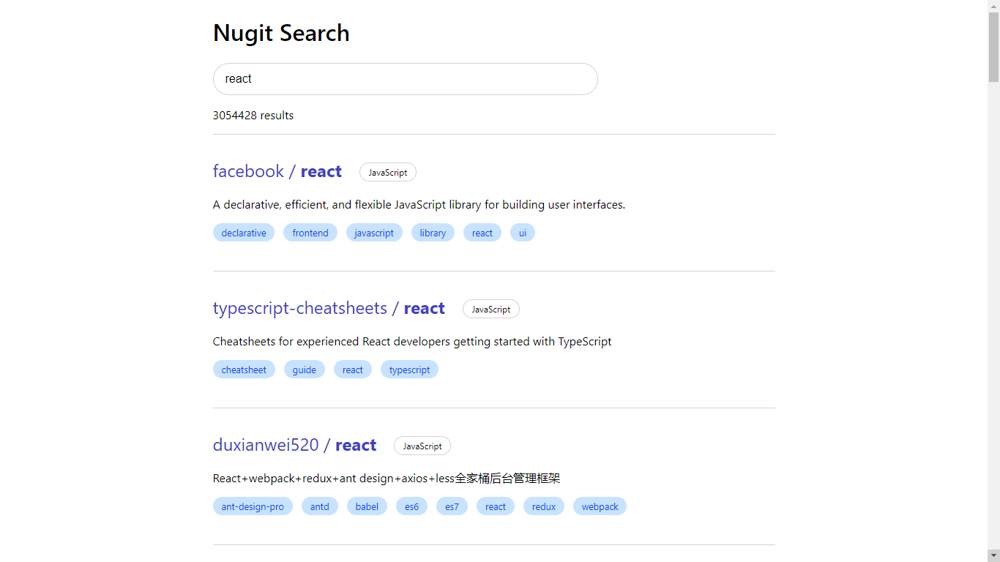

## Nugit Assignment

This project utilizes the GitHub Search API that allows users to search for repositories on GitHub. It consists of an autocomplete form that automatically suggests related terms that matched the user input.



### Running the application

Clone the repository in the local workspace.

```
git clone https://www.github.com/freddyz00/nugit-assignment
cd nugit-assignment
```

Run `npm start` to start the application on port 3000.

Open [http://localhost:3000](http://localhost:3000) to view it in your browser.

Run `npm test` to run all the tests in watch mode.
